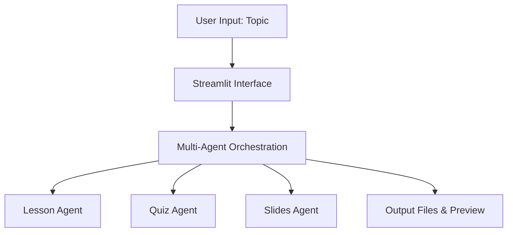

# AI Multi-Agent Course Content Generator

## Project Overview

This project demonstrates the power of **AI Multi-Agent Systems** by automatically generating educational content for any given topic. It leverages multiple AI agents to collaboratively produce lesson content, quizzes, and presentation slides, simulating a real-world multi-agent application scenario.  

**Problem Statement:**  
Creating educational content manually is time-consuming and prone to inconsistencies. Multi-agent AI systems can automate content creation efficiently, producing structured lessons, assessments, and visual aids.  

**Why Multi-Agent Systems:**  
- Each agent specializes in a distinct task (lesson, quiz, slides).  
- Parallel processing improves efficiency and modularity.  
- Agents collaborate to produce a complete learning module, demonstrating orchestration and independent operation.  

---
## Live Link

[https://saikarthik333-ai-multi-agent-course-generator.streamlit.app/](https://saikarthik333-ai-multi-agent-course-generator.streamlit.app/)

---

## Project Features

1. **Lesson Generation (Lesson Agent)**  
   - Generates structured lesson content in Markdown format.  
   - Includes introduction, key concepts, real-world examples, and summary.  

2. **Quiz Generation (Quiz Agent)**  
   - Creates assessment questions in JSON format.  
   - Includes multiple-choice and descriptive questions for testing comprehension.  

3. **Slides Generation (Slides Agent)**  
   - Produces a text-based preview of slides for presentations.  
   - Converts lesson content into slide-friendly structure.  

4. **Streamlit App Frontend**  
   - Interactive interface for users to input a topic.  
   - Generates all content on button click.  
   - Provides options to **download lesson, quiz, slides individually or as a ZIP file**.  

---

## Tools, Libraries, and Frameworks Used

- Python 3.11+
- Streamlit — Web application frontend
- LangChain and custom utilities — Orchestrating agent workflow
- Gemini and Mistral — LLMs for content generation
- pptx — Creating presentation slides
- json and pathlib — File management


---

## LLM Selection

### Ideal LLM for Professional Use
**Google Gemini 2.5 Pro**  
- Recommended for production-level applications due to its advanced reasoning, robust instruction-following capabilities, and ability to generate high-quality, structured educational content.  
- Ideal for real-world deployments where accuracy, scalability, and professional-grade outputs are required.  

### Free-tier / LLMs Used in This Project
- **Google Gemini 1.5**  
  - Used as the primary model for generating lessons, quizzes, and slides in this project.  
  - Provides high-quality content while remaining accessible without paid subscription.  
- **Hugging Face (Mistral 7B Instruct)**  
  - Used as a fallback model when Gemini 1.5 is unavailable.  
  - Ensures continuous content generation and demonstrates multi-agent fallback mechanisms.  

### Justification
- The combination of Gemini 1.5 and Hugging Face Mistral allows reliable, modular content generation within free-tier or trial limits.  
- Gemini 2.5 Pro is highlighted as the professional-grade model for future enhancements, ensuring higher reasoning capabilities, instruction adherence, and polished outputs suitable for enterprise or academic applications.

 

**Justification:**  
Gemini and Hugging Face models provide flexibility in handling different content types (text, quiz, slides). Using multiple LLMs demonstrates agent collaboration and modular architecture.  

---

## Project Architecture





- **Agents** operate independently but collaborate via Streamlit interface.  
- **Lesson Agent:** Produces Markdown file  
- **Quiz Agent:** Produces JSON file  
- **Slides Agent:** Produces PPTX file  

---

## File Structure

```

ai-course-content-generator/
│
├─ app/
│   └─ main.py           # Streamlit frontend
│
├─ agents/
│   ├─ lesson\_agent.py
│   ├─ quiz\_agent.py
│   └─ slides\_agent.py
│
├─ utils/
│   ├─ file\_utils.py
│   ├─ llm.py
│   └─ prompt\_templates.py
│
├─ data/                # Generated files saved here
│
├─ requirements.txt
└─ README.md

````

---

## Setup Instructions

1. Clone the repository:
```bash
git clone https://github.com/saikarthik333/AI-Multi-Agent-Course-Generator.git
cd AI-Multi-Agent-Course-Generator
````

2. Create a virtual environment:

```bash
python -m venv venv
source venv/bin/activate   # Linux / macOS
venv\Scripts\activate      # Windows
```

3. Install dependencies:

```bash
pip install -r requirements.txt
```

4. Run the Streamlit app:

```bash
streamlit run app/main.py
```

5. Enter a topic and generate content.
6. Download generated **lesson, quiz, and slides** individually or as a ZIP file.

---

## GitHub Repository

[https://github.com/saikarthik333/AI-Multi-Agent-Course-Generator](https://github.com/saikarthik333/AI-Multi-Agent-Course-Generator)

---


## Notes

* Each agent demonstrates **modular design** and independent execution.
* Multi-agent orchestration showcases **collaborative AI system** in a real-world application.
* Generated files include:

  * `Lesson.md` → Markdown lesson content
  * `Quiz.json` → Quiz questions
  * `Slides.pptx` → Presentation slides

---

**Author:** Motapothula Sai Karthik 

**Email:**[saikarthikmotapothula333@gmail.com](mailto:saikarthikmotapothula333@gmail.com) 

**Project Topic:** AI Multi-Agent Project 

---

